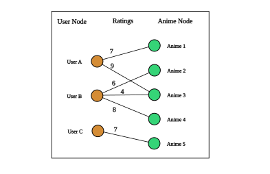
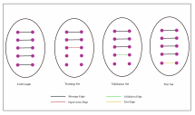

# Anime Recomendation model using modified GraphSAGE

### Problem Statement:

Create model to recommend anime (that hasn't been watched by the user) to a user. We frame this problem by Predicting user rating to animes, given user profile data, animes data and ratings already given by user to others anime he/she watched. Then give recommendations to user based on score ranking. In a sense we frame this as a link regression problem.

### Dataset:

For dataset, we use [anime-dataset-2023](https://www.kaggle.com/datasets/dbdmobile/myanimelist-dataset) from Kaggle.

Note: For experiment purpose, we use only a small fraction of the dataset by sampling it.

#### Graph dataset ilustration




### Model

For the model architecture, we use two layers of graph convolution followed by a multilayer perceptron (MLP).
We use a modified GraphSAGE for the convolution layer, where we integrating the edge features to source node features by concatenation.


 $$
h'_i =
W_{\text{msg}}
\text{mean}_{j\in\mathcal N(i)}
[x_j\Vert e_{j,i}]
+
W_{\text{root}}x_i+b_{\text{root}}
$$


### Evaluation 
Evaluation score is using Mean square error (MSE).

### Train Val Test Split

#### Train test split ilustration


the train test split is diferent from [PyG link regression tutorial](https://colab.research.google.com/drive/1N3LvAO0AXV4kBPbTMX866OwJM9YS6Ji2?usp=sharing) showed, out splits follows the typical link regression problem, since our problem setting is "Predict the rating given by a user to animes recommendation candidates based on user existing ratings data", so in training set we mask some of edges, and use the rest of edges (and its features), nodes (and its features) to predict the masked edges score.

### How to runthe scripts:

Assuming your terminal working directory in `graph_nn`. Then

- Run `init_dir.py` to initialize necessary directories.
  ```bash
    python init_dir.py
  ```

- Download dataset from https://www.kaggle.com/datasets/dbdmobile/myanimelist-dataset and put it in folder `data`

- To set config got to `config.yaml`, set params value based on your need. ex. `learning_rate`, `epochs`, `num_of_neighbors` to sample for each hops, etx

- Run `sampling_data.py` to sampling original data. The data will be sampled based on users.
  ```bash
    python sampling_data.py
  ```
- Run `create_graph_data.py` to create PyG graph data.
  ```bash
    python create_graph_data.py
  ```
- For training run
  ```bash
    python train.py
  ```
- After training, run test script
  ```bash
    python test.py
  ```
